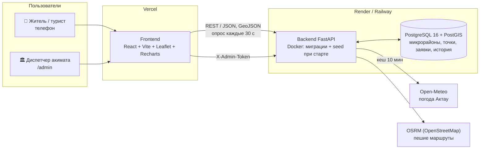

# 🌊 Caspian Breeze — карта теплового комфорта Актау

MVP для хакатона **Smart City Aktau** (Mangystau Hub).

| | Ссылка |
|---|---|
| 🗺 Карта для жителей | https://ВАШ-ПРОЕКТ.vercel.app — *вписать после деплоя* |
| 🔥 Демо-режим жары (+41 °C) | https://ВАШ-ПРОЕКТ.vercel.app/?scenario=heatwave |
| 🏛 Панель акимата | https://ВАШ-ПРОЕКТ.vercel.app/admin (токен выдаёт команда) |
| ⚙️ API и Swagger | https://caspian-breeze-api.onrender.com/docs — *вписать после деплоя* |

Как задеплоить — [DEPLOY.md](DEPLOY.md). Проверка демо-сценария на проде: `python scripts/smoke_test.py --api … --web …`.

Летом в Актау +38…+42 °C, микрорайоны с плотной застройкой и асфальтом превращаются в острова тепла.
Жители и туристы идут наугад под солнцем, а акимату не хватает данных, где именно не хватает тени,
навесов и питьевой воды. Caspian Breeze соединяет обе стороны.

## Возможности
- **Карта прохлады**: ❄️ остановки с кондиционером и ТРЦ, 💧 питьевая вода, 🌳 тенистые зоны, 🌊 набережная/бриз.
- **Зоны перегрева**: индекс дефицита тени по микрорайонам.
- **CoolPath**: пеший маршрут с наименьшей тепловой нагрузкой (крюк не более 30 %).
- **Заявки жителей**: «нет тени», «нужен фонтанчик», «сломан кондиционер» — с картой и отслеживанием статуса.
- **Панель акимата**: KPI в реальном времени, тепловая карта обращений, рейтинг микрорайонов с рекомендациями,
  смена статусов, экспорт CSV.

## Архитектура

Демо-сценарий: жара → CoolPath → «Здесь нет тени» → индекс района растёт в /admin → «Запланирован навес» →
житель видит статус в «Моих заявках». Весь путь проверяет `scripts/smoke_test.py`.

## Запуск локально

### Вариант 1 — Docker (рекомендуется, Windows / macOS / Linux)
Нужен Docker Desktop (запущенный).
```bash
git clone https://github.com/QwevroArakovich/Caspian-Breeze.git && cd Caspian-Breeze
cp .env.example .env          # Windows PowerShell: copy .env.example .env
docker compose up --build -V
```
Через 1–3 минуты (первая сборка дольше):
- карта жителя — http://localhost:5173 (демо-жара: http://localhost:5173/?scenario=heatwave);
- панель акимата — http://localhost:5173/admin, токен — значение `ADMIN_TOKEN` из `.env` (по умолчанию `change-me`);
- API и Swagger — http://localhost:8000/docs.

Миграции и данные Актау загружаются сами при старте backend. Остановить — `Ctrl+C`, данные базы сохраняются в томе `pgdata`
(стереть всё — `docker compose down -v`).

### Вариант 2 — без Docker
Нужны Python 3.11+, Node.js 20+, PostgreSQL 16 с расширением PostGIS.
```bash
# база: создать БД и пользователя, как в .env (DATABASE_URL), затем:
cd backend && pip install -r requirements.txt && alembic upgrade head && python -m seed.seed && uvicorn app.main:app --reload
# во втором терминале:
cd frontend && npm install && npm run dev
```

### Вариант 3 — запасное однофайловое демо без базы и Node
`pip install -r requirements.txt && streamlit run app.py` — Streamlit + SQLite, тот же сценарий в одном окне
(на случай, если на площадке нет интернета). Подробнее — раздел «Демо-версия на Streamlit».

### Карта для жителя (frontend)
- Полноэкранная карта Актау (React + Leaflet), вёрстка сначала под телефон.
- Плашка погоды: ощущаемая температура на цвете уровня опасности, совет по часам, лента прогноза на 12 ч.
  Демо-режим жары: http://localhost:5173/?scenario=heatwave
- Слои: нехватка тени по микрорайонам, 4 группы точек охлаждения, тепловая карта жалоб.
- «Ближайшая прохлада»: геолокация (или клик по карте, если доступа нет / вы не в Актау) → 5 ближайших точек.
- «Маршрут в тени» (CoolPath): старт — геолокация или клик, финиш — клик или быстрые кнопки (набережная, ТРЦ, сквер);
  варианты на карте (зелёный — рекомендованный), карточка «На N % меньше солнца, +M мин», точки отдыха по пути.
- «Сообщить о проблеме» 📣: тип, комментарий, место (по умолчанию — геолокация, можно указать на карте).
  Из маршрута — кнопка «Здесь нет тени» на самом открытом участке (точка и комментарий заполняются сами).
- «Мои заявки» 🧾: статус и история по номеру, без регистрации; ссылка вида `/?report=42`.
- Слой заявок (цвет — статус), тепловая карта и индекс районов обновляются каждые 30 с (опрос сервера).
- После добавления npm-пакетов пересоздайте контейнер фронтенда: `docker compose up --build -V`.

### Панель акимата — http://localhost:5173/admin
- Вход по токену (`ADMIN_TOKEN` из `.env`); токен хранится только в памяти вкладки и уходит в заголовке `X-Admin-Token`.
- KPI: открытые заявки, средний индекс нехватки тени, заявки за 7 дней (к прошлой неделе), топ-3 микрорайона.
- Карта: хороплет по индексу + тепловая карта заявок; клик по микрорайону фильтрует таблицу.
- Рейтинг микрорайонов с сортировкой и рекомендацией «установить N навесов, M фонтанчиков»
  (эвристика — `backend/app/services/recommend.py`).
- Графики (Recharts): заявки по дням за 30 дней, типы жалоб.
- Таблица заявок: фильтры, смена статуса с комментарием для жителя, экспорт CSV (Excel, `;`, UTF-8 с BOM, ссылка на 2GIS).
- На Vercel маршрут `/admin` работает благодаря `frontend/vercel.json`.

### REST API (документация Swagger — http://localhost:8000/docs)
| Метод | Путь | Что делает |
|---|---|---|
| GET | `/api/weather` | погода Актау (Open-Meteo, кеш 10 мин), `heat_level`, прогноз на 12 ч; `?scenario=heatwave` — симуляция +41 °C |
| GET | `/api/districts` | GeoJSON микрорайонов + `shade_deficit_index` и вклад каждого фактора |
| GET | `/api/cooling-points` | точки охлаждения; `?type=park,fountain`, `?bbox=minLon,minLat,maxLon,maxLat` |
| GET | `/api/cooling-points/nearest` | ближайшие точки: `?lat=&lon=&limit=5` (расстояние в метрах) |
| POST | `/api/reports` | новая заявка `{type, comment, lat, lon}`, микрорайон определяется автоматически |
| GET | `/api/reports` | заявки; `?status=new,planned&district_id=&from=&to=` |
| GET | `/api/reports/{id}` | заявка с историей статусов |
| PATCH | `/api/reports/{id}/status` | смена статуса, заголовок `X-Admin-Token` |
| GET | `/api/reports/heatmap` | `[[lat, lon, weight], …]` для тепловой карты |
| GET | `/api/admin/check`, `/api/admin/summary` | проверка токена; KPI, рейтинг с рекомендациями, графики (нужен `X-Admin-Token`) |
| GET | `/api/admin/reports.csv` | CSV заявок; `?status=&district_id=&type=` (нужен `X-Admin-Token`) |
| POST | `/api/route/cool` | CoolPath: `{from: [lat, lon], to: [lat, lon], scenario?}` → варианты с `heat_exposure`, точками отдыха и рекомендацией |

Тесты (нужна запущенная БД; изменения откатываются после каждого теста):
```bash
cd backend && pip install -r requirements-dev.txt && python -m pytest -q
```

### Данные Актау (backend/seed)
- `data/districts.geojson` — 15 микрорайонов (упрощённые полигоны), `data/cooling_points.geojson` — 49 точек охлаждения,
  `data/reports.geojson` — 42 демо-заявки (даты считаются от момента запуска, за последние 30 дней).
- `python -m seed.seed` — идемпотентно; `python -m seed.seed --reset-reports` — пересоздать демо-заявки со свежими датами.
  Заявки жителей (source = form / coolpath) seed не трогает.
- `python -m seed.generate_data` — пересобрать GeoJSON (нужен `pip install -r requirements-dev.txt`).

<details><summary>Без Docker</summary>

```bash
# backend (нужен локальный PostgreSQL 16 + PostGIS)
cd backend && pip install -r requirements.txt && alembic upgrade head && uvicorn app.main:app --reload
# frontend
cd frontend && npm install && npm run dev
```
</details>

## Демо-версия на Streamlit (запасной вариант)
Однофайловый MVP `app.py` на SQLite — запасной вариант для питча, пока переносим функции в новую архитектуру.
```bash
pip install -r requirements.txt
streamlit run app.py
```
Токен диспетчера для демо: `aktau2026`.

| Переменная | По умолчанию | Назначение |
|---|---|---|
| `CB_DB_PATH` | `caspian_breeze.db` | путь к SQLite-базе |
| `CB_ADMIN_TOKEN` | `aktau2026` | токен панели акимата |

## Структура
```
backend/     FastAPI, SQLAlchemy 2, GeoAlchemy2, Alembic (миграции в backend/alembic/versions)
frontend/    Vite + React + TypeScript (vercel.json — маршрут /admin на Vercel)
scripts/     smoke_test.py — проверка демо-сценария на задеплоенной версии
render.yaml  Render Blueprint: PostgreSQL + backend одной кнопкой
app.py       Streamlit-демо (SQLite)
docker-compose.yml   db (postgis/postgis:16) + backend + frontend
```

## Индекс дефицита тени (0–100)
```
0.40 · базовый нагрев микрорайона
+ 0.25 · (1 − доля зелени)
+ 0.20 · открытые заявки жителей (12 и больше = максимум)
+ 0.15 · (1 − плотность точек охлаждения на км², нормировано по лучшему району)
```

## Что работает сейчас / что за рамками хакатона

### ✅ Работает в MVP
| Для кого | Что |
|---|---|
| Житель, турист | Карта Актау: 49 точек охлаждения в 4 группах, нехватка тени по 15 микрорайонам, тепловая карта жалоб |
| | Погода Актау (Open-Meteo, кеш 10 мин) с советом по часам; переключатель «+41 °C, июль» — честно подписанная симуляция |
| | «Ближайшая прохлада»: геолокация или клик → 5 точек с минутами пешком |
| | CoolPath: реальные пешие маршруты OSRM + вариант через тень/бриз, оценка солнца на каждые 50 м, рекомендация |
| | Заявки «нет тени / нужна вода / сломан кондиционер» — из формы или в один тап с маршрута; статус по номеру без регистрации |
| Акимат | Панель /admin: KPI, карта, рейтинг микрорайонов с рекомендациями «N навесов, M фонтанчиков», графики, смена статусов, CSV для Excel |
| | Кнопка «🔄 Демо-режим» — вернуть данные к исходным для повторного показа |
| Техника | Свой backend FastAPI + PostgreSQL/PostGIS (миграции Alembic, seed), 14 тестов, Docker, деплой Render/Railway + Vercel, smoke-тест сценария |
| | Мобильная вёрстка, плашка «нет интернета», повтор загрузки при ошибке сервера, пустые состояния |

### 🔭 За рамками хакатона
- **IoT-датчики температуры** на остановках и во дворах — реальная температура вместо модельной, тревога при перегреве павильона.
- **Спутниковые данные Landsat LST** (температура поверхности, бесплатно) — заменить модельный `heat_index_base` на измеренный.
- **Модель тени от зданий по времени суток** — высоты зданий + положение солнца → тень каждого тротуара по часам; CoolPath станет
  маршрутизацией по графу с тенями.
- **Интеграция с eOtinish и 2GIS** — заявки уходят в единую систему обращений, точки охлаждения берутся из справочника 2GIS.
- **Push-уведомления о жаре** — «завтра +42 °C, вот ближайшие к вам точки прохлады».
- Фото к заявкам, модерация, роли диспетчеров, свой OSRM-сервер под нагрузку, казахская версия интерфейса полностью.

## Демо на питче
Сценарий по секундам и ответы на вопросы жюри — [DEMO_SCRIPT.md](DEMO_SCRIPT.md).
